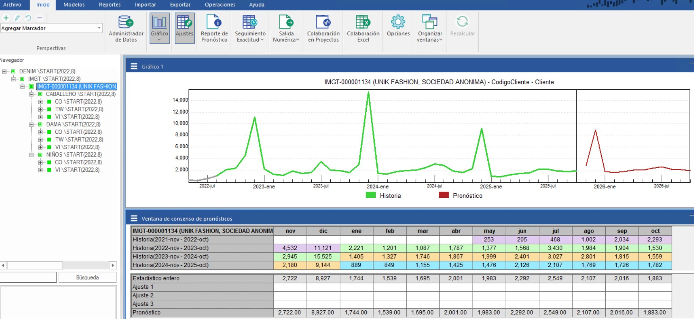
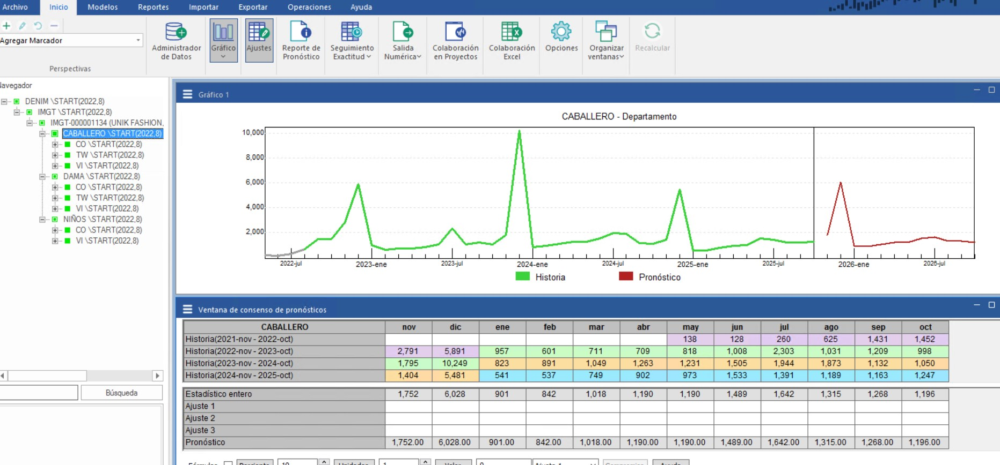
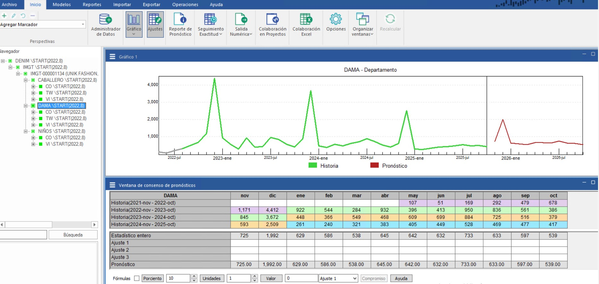

# 📊 Sales Forecasting - Intermoda S.A

**⚠️ Note:** This is a real forecasting project for Intermoda S.A. All data belongs to the company; the complete dataset cannot be shared.

---

## 📋 Project Summary
The goal of this forecast was to provide an overview of expected sales for **early 2026** using **Forecast Pro**, applying an **exponential smoothing** model with a **bottom-up** strategy.

The dataset contains sales reports from **2022**. The main product is **dress jeans**, organized in this hierarchy:  

- 👖 Gender  
- 🏷️ Base  
- 🎨 Color  
- 📏 Size  

---

## 🛠️ Methodology
1. Loaded historical sales data (2022) into **Forecast Pro**.  
2. Applied **exponential smoothing**, selecting the most suitable variant based on trend and seasonality.  
3. Used **bottom-up** strategy: forecasts were generated at the most granular level first and then aggregated to higher levels.  
4. Created charts and tables to visualize projections and detect patterns.  

---

## 📊 General Insights
### General
📈 The projection shows a stable trend for the first quarter – barring the marked seasonality of December – in which the sales forecast is higher than in 2025 but slightly lower than in 2024. However, this is considered a good sign of improvement for this specific client.

  

### Gentlemen jeans
🌟For the men's category – which makes up the bulk of sales – the improvement is even more remarkable, as the forecast is getting closer to 2024 sales and in some areas even surpasses them, a good upward trend. 

   

### Lady jeans
🌟With women's jeans the situation changes a little; the trend is not as favorable but it is not downward either; it continues to exceed the 2025 expectation but does not reach the sales of 2024.

 

---
## 💡 Key Insights
  
  

(Additional charts and insights are available in the `assets/` folder.)

---

## 🗂️ Repository Structure
Sales_Forecasting/
│
├─ assets/ # Screenshots, charts, and insights
│ ├─ General.jpg
│ ├─ Gentlemen/childen/lady .png #imgs
│ └─ insights.jpg
│
├─ README.md # Project overview, methodology, insights
├─ summary.pdf # description of the project and results
└─ reporte_pronostico.xlsx # Summary os the results in excel from forecastpro

---

## ✅ Conclusion
This analysis allows **Intermoda S.A.** to better plan inventory and production of dress jeans for early 2026, making **data-driven decisions** based on both disaggregated and aggregated forecasts.

---

*Repository created for portfolio purposes. Complete data cannot be shared due to confidentiality.*
